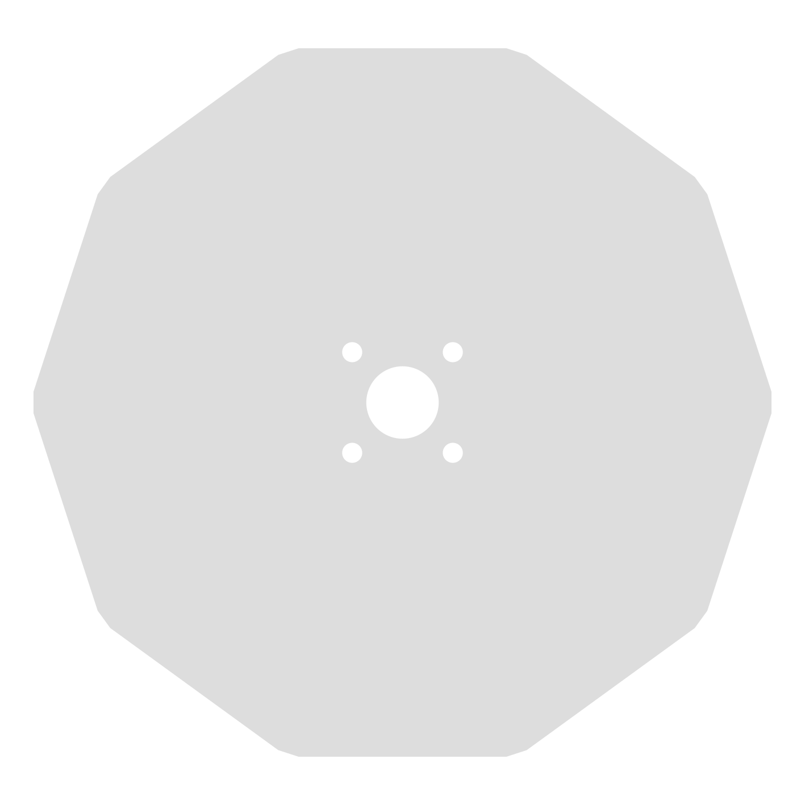

[](https://crates.io/crates/stationary-cam)

# stationary-cam

This safe Rust CLI generates SVG templates for stationary cams.

## Examples

```
git clone https://github.com/772/stationary-cam
cd stationary-cam/example
cargo r -- example.toml
```



## Building the cam

You can use the generated SVG template to cut the cam out of a metal plate, cardboard or any other material. Depending on the material of the cam, you might need a different file format.

### Using [GIMP](https://gimp.org) to convert the SVG to PNG

1. When opening the SVG with GIMP, you can select the size of the picture.
1. File -> Export As... -> example.png

### Using [Blender](https://www.blender.org) to convert the SVG to OBJ or STL

OBJ and STL files are often used for 3D printing or CNC woodworking.

1. File -> Import -> Scalable Vector Graphics (.svg)
1. Select all objects
1. Object Data Properties -> Resolution Preview U -> See console
1. Right click -> Set Origin -> Geometry to Origin
1. Right click -> Convert To -> Mesh
1. Select cam object and select all vertices
1. Press E to move them up a bit
1. Select tooth object and select all vertices
1. ALT-N -> Flip
1. Press E to move them down a bit
1. n times: Select each side or two vertices and merge to last
1. Select all objects
1. Control-M -> z
1. Right click -> Join
1. File -> Export -> e.g. Wavefront OBJ / STL etc.

### Using [Inkscape](https://inkscape.org/) to convert the SVG to DXF

DXF files are often used for metal laser cutting machines.

```
inkscape --export-type="dxf" example.svg
```

## License

Licensed under either of these:

 * Apache License, Version 2.0, ([LICENSE-APACHE](LICENSE-APACHE) or
   https://www.apache.org/licenses/LICENSE-2.0)
 * MIT license ([LICENSE-MIT](LICENSE-MIT) or
   https://opensource.org/licenses/MIT)
